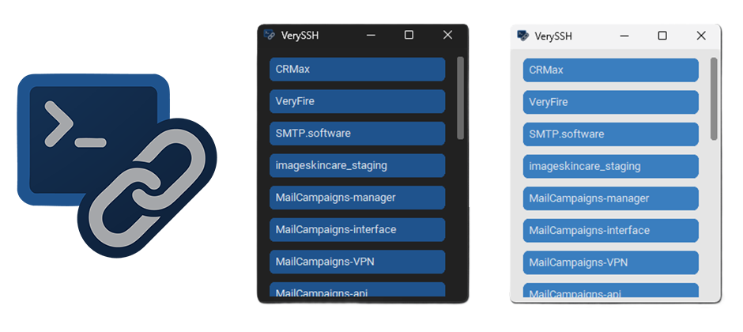

# VerySSH - Windows SSH Launcher


[](https://sourceforge.net/projects/very-ssh/files/latest/download)

A minimal, fast GUI for quickly launching SSH sessions from your `~/.ssh/config`.  
SSH keychain 🔑🔗  

---

[](https://sourceforge.net/projects/very-ssh/files/latest/download)

## 🔧 Features

- Parses `~/.ssh/config` and lists all hosts
- Click to connect via Windows Terminal (`wt ssh <host>`)
- Auto light/dark mode based on Windows settings
- Minimal, fast, and easy to use
- Easy keyboard navigation
---

## ⌨️ Keyboard Shortcuts
**Type to filter hosts**
- **Arrow Up/Down**: Navigate through the list of hosts
- **Enter**: Connect to the selected host
- **Esc**: Close the application
- **Delete**: Clear the filter

## 🚀 How to Run

### 1. Download the latest release

Go to the [Releases](https://github.com/your-repo/very-ssh/releases) page and download the pre-built `.exe` file for your platform.

### 2. Run the executable

Simply double-click the downloaded `.exe` file to launch the application.

---

## 📦 Build Standalone `.exe` (Optional)

If you prefer to build the executable yourself, follow these steps:

### 1. Install Requirements

```bash
pip install -r requirements.txt
```

### 2. Build executable

Run the build script:

```bash
build.bat
```

This default build uses `onedir` for faster startup.
Executable path:

```bash
dist/VerySSH/VerySSH.exe
```

If you need a single-file executable (slower startup), run:

```bash
build.bat onefile
```

Single-file output path:

```bash
dist/VerySSH.exe
```

Output will be in the `dist/` folder.

---

## 📁 Project Structure

```
ssh_launcher/
├── __main__.py         # Entry point
├── config.py           # SSH config parsing
├── theme.py            # Windows theme detection
├── ui.py               # GUI logic
├── assets/
│   └── icon.ico        # Application icon
.github/
└── workflows/
    └── release.yml     # GitHub Actions workflow for releases
assets/
├── banner.png          # Banner image for documentation
├── icon.ai             # Editable icon source
└── icon.png            # Icon image
build.bat               # Build script for PyInstaller
launcher.py             # Launcher script for the standalone executable
README.md               # Project documentation
LICENSE                 # License file
requirements.txt        # Python dependencies
```

---

## ✅ Example SSH Config

Make sure your `~/.ssh/config` has entries like:

```ssh
Host my-server
    HostName 192.168.1.10
    User max
```

---

## 🤝 Contributing

Contributions are welcome! Please open an issue or submit a pull request. For major changes, discuss them first by opening an issue.

## License

[MIT](./LICENSE). Do whatever the hell you want.
